# FPGA Flight Sim

## Contents

* [Introduction](#introduction)
    * [(Brief) Description of Operation](#brief-description-of-operation)
* [Proposed High Level Block Diagram](#proposed-high-level-block-diagram)
* [Hardware](#hardware)
    * [Description](#description)
    * [Module Descriptions](#module-descriptions)
* [Software](#software)
    * [Description](#description-1)
    * [User Input](#user-input)
    * [Flight Dynamics](#flight-dynamics)
        * [Parameters](#parameters)
        * [Equations](#equations)
        * [Edge Cases and Constants](#edge-cases-and-constants)
    * [Hardware Communication](#hardware-communication)
        * [Communication Protocol](#communication-protocol)
        * [Data Packing](#data-packing)
        * [Memory\-Mapped I/O](#memory-mapped-io)
    * [Main Loop](#main-loop)
    * [Vivado Block Design](#vivado-block-design)
    * [Summary of Block Design Components](#summary-of-block-design-components)
    * [Summary of Program Files](#summary-of-program-files)
* [FPGA Implementation](#fpga-implementation)
    * [RTL Block Diagram](#rtl-block-diagram)
    * [Design Analysis](#design-analysis)
* [Conclusion](#conclusion)
    * [AI Usage](#ai-usage)
    * [References](#references)

## Introduction

For our project, we designed and implemented a comprehensive 3D flight
simulator, similar to Microsoft Flight Simulator and FlightGear (albeit
not as complex), using the RealDigital Urbana Board. The flight
simulator presents users with a virtual plane, which they can control
using input devices (keyboard, joystick, etc.) to take off, fly, and
land. The surroundings are rendered in real-time on a connected monitor,
providing an immersive experience.

### (Brief) Description of Operation

The operation of our project is rather simple; after connecting a USB
keyboard to the Urbana Board as well as an HDMI connector to an external
monitor, the user can control the displayed 3D object by different keys
(W, A, S, D, etc.) which represent actions like increasing/decreasing
throttle, banking left/right, etc. The background of the 3D object
updates with respect to the changes in position, altitude, etc.

## Proposed High Level Block Diagram

<div align="center">
    <figure>
        <p>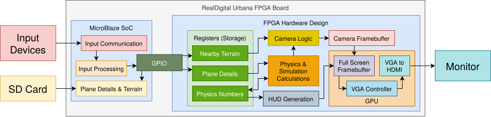</p>
        <figcaption><p>Block Diagram</p></figcaption>
    </figure>
</div>

Figure 1 shows our proposed block diagram. As you will see in this
report, we deviated substantially from this design due to resource
constraints and other miscellaneous design choices.

## Hardware

### Description

The hardware component of this project is responsible for rendering
objects to the monitor, as shown in Figure 1. Because we implemented 3D
rendering, we added a fairly large graphics pipeline between the display
logic and the object data storage (ROMs). The addition of 3D graphics
necessitated the implementation of several vector/matrix processing
units, used for applying linear transformations, projection, and
interpolation.

In our implementation, we leveraged the DDR3 memory capabilities of the
RealDigital Urbana board--thus allowing us to store large video buffers
(VRAM) which ordinarily would not have fit within BRAM/Distributed RAM
on the Spartan-7 FPGA (or at least without extraordinary logic element
usage).

### Module Descriptions

#### flight_sim_top.sv

flight_sim_top.sv is our top level file which instantiates both the
graphics component of our project, as well as the block diagram shown in
Figure 10.

#### ddr_renderer_top.sv

ddr_renderer_top.sv is our top-level graphics module, instantiating the
line buffer, graphics pipeline, graphics cache, and necessary
arbitration and state machine logic.

The overall high-level structure of ddr3_renderer_top is given by Figure
2.

<div align="center">
    <figure>
        <p>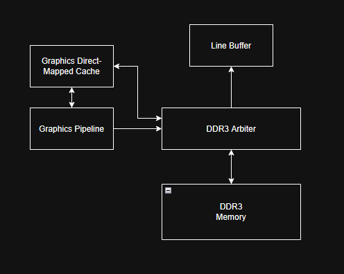</p>
        <figcaption><p>Block Diagram of ddr3 rendering
        mechanism.</p></figcaption>
    </figure>
</div>

Our light-weight DDR3 controller is capable of doing a single DRAM R/W
request at a time, which necessitated the DDR3 arbiter. In our
implementation, it consisted of a priority encoder:

``` sv
if (fbuf_active) begin
    ddr3_mem_wrdy = 1'b0;
    ddr3_cache_ready = 1'b0;
    app_addr = rd_addr;
    r_phy_cmd_en = rd_cmd_en;
    r_phy_cmd_sel = rd_cmd_sel;
    r128_wrdata = 'b0;
end else if (init_active) begin
    // if initialization is active, frame buffer CAN interrupt it in order to display
    ddr3_cache_ready = 1'b0;
    ddr3_mem_wrdy = ~wr_cmd_en;
    app_addr = staging_buffer_addr + wr_addr;
    r_phy_cmd_en = wr_cmd_en;
    r_phy_cmd_sel = wr_cmd_sel;
    r128_wrdata = ddr3_wr_data;
end else if (cache_active) begin
    // cache is uninterruptable
    ddr3_cache_ready = !w_phy_cmd_full;
    ddr3_mem_wrdy = 1'b0;
    app_addr = cache_ddr3_addr;
    r_phy_cmd_en = cache_ddr3_req;
    r_phy_cmd_sel = cache_ddr3_rw_n;
    r128_wrdata = cache_ddr3_dout;
end else begin
    ddr3_mem_wrdy = ~wr_cmd_en;
    ddr3_cache_ready = 1'b0;
    app_addr = staging_buffer_addr + wr_addr;
    r_phy_cmd_en = wr_cmd_en;
    r_phy_cmd_sel = wr_cmd_sel;
    r128_wrdata = ddr3_wr_data;
end
```

In this implementation, the line buffer (responsible to writing to the
HDMI output) is given highest priority, followed by the initialization
module, cache, and lastly, the graphics.

To allow the graphics and display logic to work concurrently, we use a
double-buffering technique. We instantiate two VRAMs in our DDR3--one
from address 0x00000 to 0x4AFFF, and another from address 0x4B000 to
0x95FFF. We label one as the "output" buffer and the other as the
"staging" buffer. On every falling edge of `vsync`, we swap the pointers to these buffers, thus allowing for consistent
output to the monitor.

An excerpt of this implementation is shown below:

``` sv
if (~vsync && old_vga_vsync) begin
    rd_addr_offset <= 27'b0;
    // on falling edge of vsync, swap buffers
    staging_buffer_addr <= output_buffer_addr;
    output_buffer_addr  <= staging_buffer_addr;
end 
```

Lastly, ddr3_renderer_top has an FSM to handle DDR3 reads/writes.

<div align="center">
    <figure>
        <p>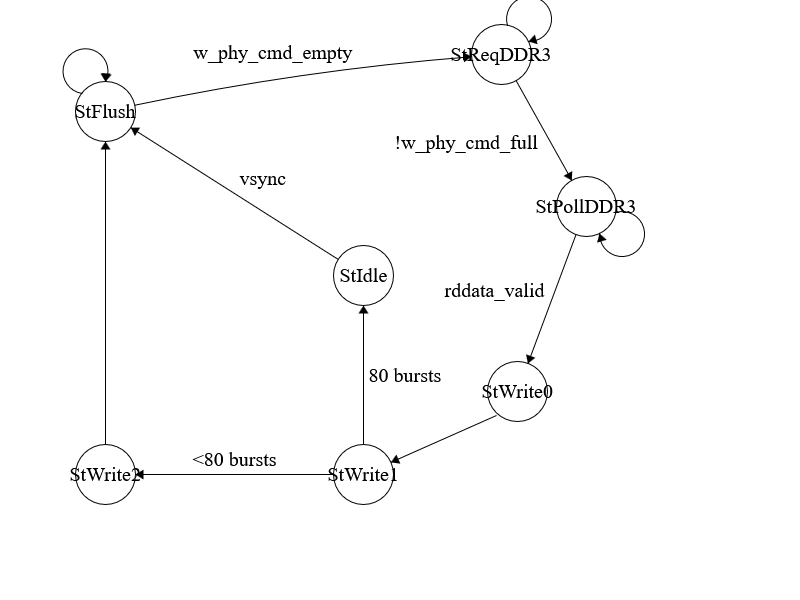</p>
        <figcaption><p>FSM Diagram of DDR3 Read Logic</p></figcaption>
    </figure>
</div>

For reference, the `vsync` signal refers to the **falling edge** of the actual vsync signal.
Signals `w_phy_cmd_empty` and `w_phy_cmd_full` come from the DDR3 command FIFO, as per the light-weight controller
specification. Each DDR3 burst writes 128 bytes, equivalent to 8 pixels
on the screen. Thus, in order to read a full horizontal strip into the
line buffer, we need 80 consecutive DRAM bursts. The `StFlush` state exists in order to avoid potential cache read/write requests from
executing under the line buffer.

#### ddr3_arbiter

The ddr3_arbiter.sv module is poorly named--it just instantiates the
DDR3 objects as per the specification of the light-weight DDR3
controller. Furthermore, it connects to LED\[3:0\] on the Urbana board,
indicating whether DDR3 is enabled/disabled.

#### ddr3_rdcal.v/ddr3_x16_phy_cust.v/ddr3_x16_phy_params.vh

These files are imported from the light-weight DDR3 controller module.

#### frame_buffer.sv

frame_buffer.sv defines the horizontal line buffer which is displayed to
the HDMI monitor. Internally, it consists of a True Dual Port BRAM
instantianted with size 640x1, with each address defining a 16-bit color
space. One port of the BRAM is used to write data in from
ddr3_renderer_top, while the other port is used to display color data to
the VGA to HDMI IP.

In order to read data in from ddr3_renderer_top, there is a (trivial)
FSM consisting of IDLE, ACTIVE, and WAIT states. There is also
combinational logic to map the corresponding 128-bit bursts from DDR3
into locations within BRAM. The following is an excerpt of that logic:

``` sv
bram_waddr = bram_addr_base + {7'b0, bram_wr_dbyte_index_q};

for (integer i = 0; i < 8; i = i + 1) begin
    if (bram_wr_dbyte_index_q == i) begin
        bram_dina = bram_dina_burst[i*16 +: 16];
    end
end
```

#### cache.sv

The GPU makes frequent DDR3 reads (primarily during the Z-buffer state
of the pipeline), which necessitates the use of caching in order to
improve performance.

The cache consists of a single port BRAM, structured into sixteen
512-bit wide cache lines (32 consecutive values). We could achieve
better spatial locality by expanding the width of our cache lines, but
this comes at a cost of increased DDR3 latency, which could potentially
interfere with other aspects of the design.

The cache uses the following FSM in Figure 4:

<div align="center">
    <figure>
        <p>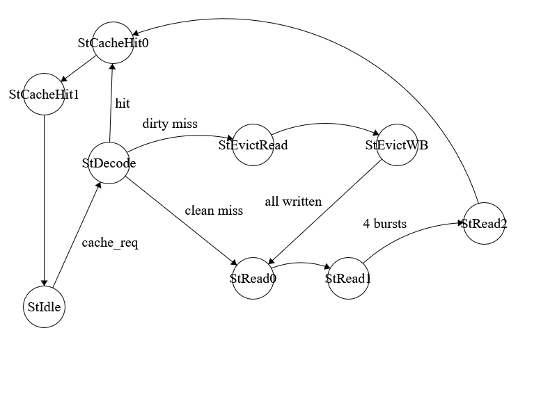</p>
        <figcaption><p>FSM Diagram of Direct-Mapped Cache Logic</p></figcaption>
    </figure>
</div>

We implemented a write-back cache, which writes back to main memory only
when a particular cache line has been modified **and** a dirty miss
occurs at that particular line. In the event of `StEvictWB`, the cache writes sequential 128-bit chunks to DDR3, of which there are
four. After everything is written, it begins reading new data into the
cache line.

We have used the transition `cache_req` for brevity. In our implementation, this signal is driven by certain
control signals within the Z-buffer.

#### graphics_top.sv

This is the top-level graphics module which instantiates all modules in
the graphics pipeline. Furthermore, it contains a (trivial) FSM to draw
a background to VRAM, after which the rest of the 3D graphics are
overlayed on top of it.

#### gpu_wb_controller.sv

In order to make efficient usage of DDR3, we devised a basic memory
coalescing mechanism within gpu_wb_controller. At a high-level, the
writeback controller waits for 8 sequential memory adddresses to be
written to, after which point it executes one DDR3 write operation. In
the event that the writeback controller recieves a memory address not in
the same continguous area, it flushes the current buffer to DDR3, and
then reads the new value.

The FSM for writeback logic is shown in Figure 5.

<div align="center">
    <figure>
        <p>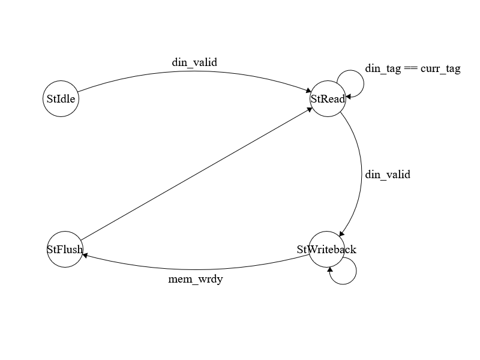</p>
        <figcaption><p>FSM Diagram of Writeback Controller Logic</p></figcaption>
    </figure>
</div>

For reference, values `din_tag` and `curr_tag` refer to the current address tag of data in, as well as the values
stored within the writeback buffer, respectively. During `StRead`, data values are being continuously read in from the rest of the
graphics pipeline. This coalesced buffer is then written to DDR3 in `StWriteback` and `StFlush`. In our implementation, `StIdle` is the default state, and none of the other states ever transition back
to it.

#### zbuffer.sv

zbuffer.sv implements a Z-buffer, allowing for displaying relative depth
within our graphics pipeline. It takes in `alpha`, `beta`, and `gamma` values from the rasterizer, as well as the Z-values of the three
vertices of the current triangle being rendered. It then uses the
following formula:

$$Z_{\text{pixel }} = \alpha_{\text{pixel }}Z_{0} + \beta_{\text{pixel }}Z_{1} + \gamma_{\text{pixel }}Z_{2}$$

in order to calculate the Z-value of the current pixel (Barycentric
Interpolation). This calculation is implemented by inferring DSP units
on the FPGA:

``` sv
tmp0 = $signed(z0) * $signed(alpha);
tmp1 = $signed(z1) * $signed(beta);
tmp2 = $signed(z2) * $signed(gamma);

sum = tmp0 + tmp1 + tmp2;
```

Note: a potential optimization we could have done to reduce WNS would be
to pipeline this into a explicit multiplication and addition stage,
instead of performing the entire interpolation combinationally.

After calculating the incoming Z-value, it is compared with the current
Z-value being stored in memory (these memory accesses are done through
cache). If this Z-value is smaller (closer to POV), the pixel is
replaced (send to the write buffer).

#### rasterizer.sv

rasterizer.sv is responsible for generating a sequence of pixels which
are bounded by the specified triangle, passed in from the projector
module. It also instantiates the barycentric calculation module, which
determines if pixels fall within the specified triangle, as well as the
barycentric coordinates ($\alpha,\beta,\gamma$)

The rasterizer logic consists of the FSM shown in Figure 6.

<div align="center">
    <figure>
        <p>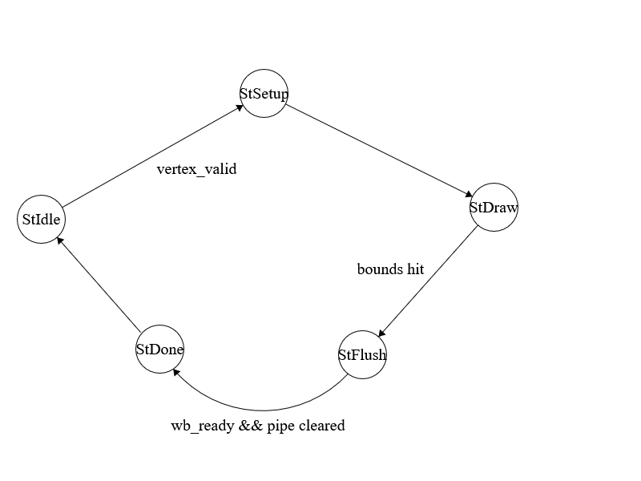</p>
        <figcaption><p>FSM Diagram of Rasterizer Logic</p></figcaption>
    </figure>
</div>

For reference, `StSetup` calculates the bounds of the smallest rectangular which fully contains
the specified triangle. These bounds are used to determine when `StDraw` transitions to `StFlush`. `StFlush` is used to wait for residual values in the address/valid pipelines to
clear, after which it transitions to `StDone`.

##### barycentric_calc.sv

barycentric_calc.sv is a module instantianted within our rasterizer
which calculates barycentric coordinates for each pixel within the
bounding box and determines whether it is within the specified triangle.

This module first calculates mulitple areas using 2D cross products:

$$\begin{array}{r}
\text{ Area}(P,A,B) = \left( A_{x} - P_{x} \right)\left( B_{y} - P_{y} \right) - \left( A_{y} - P_{y} \right)\left( B_{x} - P_{x} \right) \\
\text{Area}(P,B,C) = \left( B_{x} - P_{x} \right)\left( C_{y} - P_{y} \right) - \left( B_{y} - P_{y} \right)\left( C_{x} - P_{x} \right) \\
\text{Area}(P,C,A) = \left( C_{x} - P_{x} \right)\left( A_{y} - P_{y} \right) - \left( C_{y} - P_{y} \right)\left( A_{x} - P_{x} \right)
\end{array}$$

The ratio of these areas to the overall inverse area of the triangle
$ABC$ returns the barycentric coordinates $\alpha,\beta,\gamma$.

In our implementation, we take advantage of the fact that
$\alpha + \beta + \gamma = 1$ to calculate
$\gamma = 1 - \alpha - \beta$, saving us from using excessive DSP units.
This is shown in the excerpt below:

``` sv
alpha_o <= r_norm1_6;
beta_o <= r_norm2_6;
gamma_o <= $signed(32'h01000000) - r_norm1_6 - r_norm2_6;
within_tri_7 <= within_tri_6;
```

FP32 is expensive to implement in FPGAs, so we chose to used fixed-point
Q8.24 and Q16.16 for all calculations, depending on the degree of
fractional precision required. In this excerpt, `32'h01000000` is equal to decimal $1$ in Q8.24.

We determine if a point is within the triangle by checking if the sign
bit of all three areas are the same.

<div align="center">
    <figure>
        <p>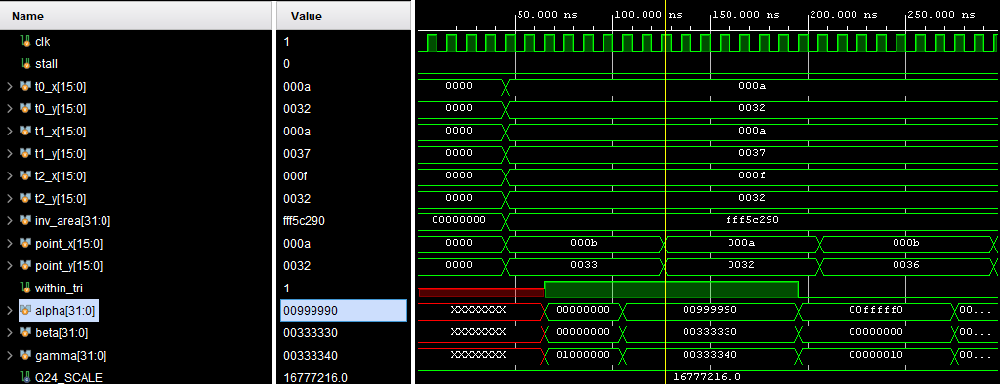</p>
        <figcaption><p>Testbench of Barycentric Calculation Module</p></figcaption>
    </figure>
</div>

The above testbench shows the operation of the barycentric_calc module.
After a point in the $640 \times 480$ screen space is passed to the
module, it calculates the $\alpha,\beta, \land \gamma$ values in Q16.16,
and determines if the pixel is within the triangle. This process is
pipelined with 8 cycles of latency.

#### projector.sv

projector.sv is responsible for projecting 3D points onto points in the
640x480 2D screen space. It achieves this projection by applying a
specific (sparse) projection matrix, and then dividing the x, y, and
translated z coordinates by z.

We configured the divide IP to use the high-radix mode as opposed to
radix-2. This allows significantly less LUT usage, at the cost of
significantly increased DSP unit usage. The observered latency of this
IP was around 50 cycles. While this is significantly longer than the
latency of other arithmetic operations, we must consider:

- The bottleneck in our graphics unit is the rasterizer module, as it
  performs operations at the order of $O(NM)$ where $N$ and $M$
  represent the size of the bounding box.

- This costly division operation needs to be performed at most 3 times
  for each of the three vertices of the triangle.

- Our graphics pipeline is clocked at 200Mhz, so the per-triangle
  latency for division amounts to at most $1\mu s$.

##### Joint testbench for projector and rasterizer module

<div align="center">
    <figure>
        <p>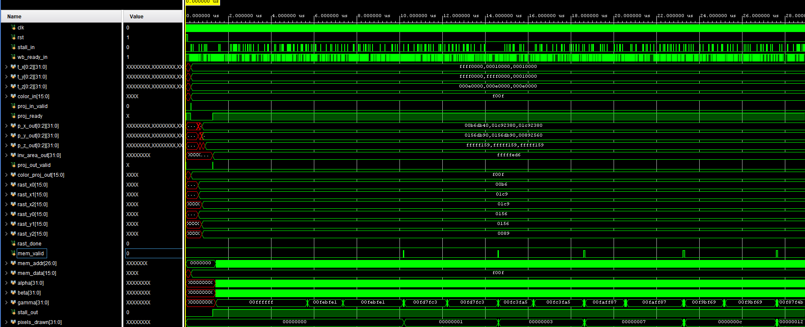</p>
        <figcaption><p>Joint testbench for Projector and Rasterizer Module</p></figcaption>
    </figure>
</div>

Above is an example testbench. Projector is fed an array of triangle
vertices, which is converted to 2D and sent to the rasterizer, which
generates the respective pixel values.

We can see that around $0.250\mu s$, `proj_out_valid` is asserted high, indicating that the output of the projector module is
valid. At this point, the rasterizer module reads the vertex data and
begins generating pixel values as seen at time $10.175\mu s$, for
example.

This particular testbench generates a ASCII representation of the final
image, as seen below:

<div align="center">
    <figure>
        <p>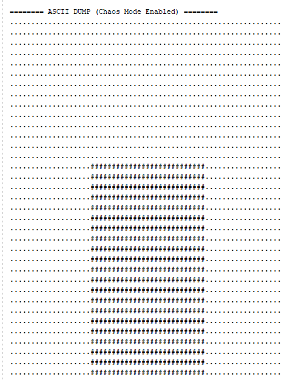</p>
        <figcaption><p>ASCII output of above testbench. In this case, we draw a cube.</p></figcaption>
    </figure>
</div>

#### transformation.sv

transformation.sv is responsible for applying a linear transformation to
the vertices of a triangle. This allows for rotations and translations
within 3D space, which gets mapped down to 2D coordinates by
projector.sv.

An excerpt of these matrix operations is shown below:

``` sv
next_opt_x = products[0][0] + products[0][1] + products[0][2] + $signed({matrix[0][3], 16'b0});

next_opt_y = products[1][0] + products[1][1] + products[1][2] + $signed({matrix[1][3], 16'b0});

next_opt_z = products[2][0] + products[2][1] + products[2][2] + $signed({matrix[2][3], 16'b0});
end
```

As previously mentioned, we use fixed-point Q16.16 instead of FP32,
hence the 16-bit left shifts to convert values to Q16.16.

#### gpio.sv

gpio.sv instantates the transformation module, and generates the
transformation matrix which is passed to transformation.sv. It does so
by reading data from the GPIO (this will be further elaborated upon in
the software section). This data is then sent to a Xilinx CORDIC IP to
generate cosine/sine values which ar passed into the output matrix.

The interaction between gpio.sv and transformation.sv is shown below:

``` sv
transformation transformation_inst (
    .clk(clk),
    .rst(rst),
    .t_x(initial_t_x),
    .t_y(initial_t_y),
    .t_z(initial_t_z),
    .color(16'hFFFF),
    .in_valid(out_valid),
    .data_read(data_read),
    .model_matrix('{
        '{ cos, -sin, 10'b0, 10'b0 },
        '{ sin,  cos, 10'b0, 10'b0 },
        '{ 10'b0, 10'b0, 10'h100, 10'b0 }
    }),
    .stall(1'b0),
    .out_x(transformed_t_x),
    .out_y(transformed_t_y),
    .out_z(transformed_t_z),
    .color_out(color_out),
    .valid(transform_valid)
);
```

gpio.sv also has a (trivial) FSM which continually reads values from the
CORDIC IP, passes the data to the transformation module, and then waits
for the next set of vertices to be passed.

#### model_engine.sv

model_engine.sv is responsible for sending vertex/face data to the rest
of the graphics pipeline. Internally, it instantiates two ROMs `vertex_rom` and `face_rom`, each of which are BRAM arrays holding vertex/face data in a particular
format:

Vertex data is stored in BRAM as 96-bit values, holding the Q16.16
$(X,Y,Z)$ data of each vertex.

Face data is stored in BRAM as 32-bit values, where bits \[31:16\] store
the color of the particular triangular face, and bits \[15:0\] store the
addresses of each vertex within the vertex ROM.

The Vertex and Face ROMs are intialized with their respective .coe file
in order to load the appropriate data.

## Software

### Description

The software component of the flight simulator is primarily responsible
for handling user inputs, calculating flight dynamics by running an
accurate physics simulation, and communicating the plane's state to the
hardware design for rendering.

### User Input

User inputs are handled through USB keyboard communication.
Specifically, the Serial Peripheral Interface (SPI) protocol is used to
communicate with the MAX3421E chip on the FPGA board.

Using this SPI primitive, the MicroBlaze implements a USB driver that
performs high-level USB operations, like listing connected devices,
configuring them, and reading data. This driver is implemented in
`MAX3421E.c` and other files in the `lw_usb` directory.

Additionally, the MAX3421E chip also connects to some non-SPI pins on
the FPGA board---specifically, the interrupt and reset pins. The
complete interface between the FPGA and MAX3421E chip is shown below. The interrupt and
reset pins are both connected into GPIO modules (`gpio_usb_int` and
`gpio_usb_rst`) in the Vivado block design, allowing the MicroBlaze to
read the interrupt status and control the reset line via MMIO.

<div align="center">
    <figure>
        <p>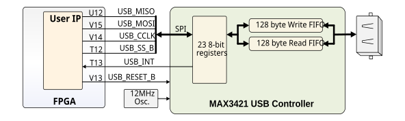</p>
        <figcaption><p>Connection between the FPGA and MAX3421E chip</p></figcaption>
    </figure>
</div>

The MicroBlaze uses the USB driver to read keyboard inputs from the user
every timestep. Specifically, the keys for controlling the plane are as
follows:

- Throttle: **Up Arrow** (Increase), **Down Arrow** (Decrease)

- Rudder: **Left Arrow** (Left), **Right Arrow** (Right)

- Elevators: **W** (Pitch Up), **S** (Pitch Down)

- Ailerons: **A** (Roll Left), **D** (Roll Right)

The `usb.c` file contains the code for reading and processing these
keyboard inputs. It implements the `usb_get_inputs` function, which
parses these key presses into a `struct usb_report` data structure
containing the current user inputs. The struct definition is as follows:

``` c
#include "xil_types.h"

struct usb_report {
    u8 is_throttle_up;
    u8 is_throttle_down;
    u8 is_pitch_up;
    u8 is_pitch_down;
    u8 is_roll_left;
    u8 is_roll_right;
    u8 is_yaw_left;
    u8 is_yaw_right;
};
```

### Flight Dynamics

A significant portion of the difficulty for this project came from
implementing accurate flight dynamics. At first, we attempted to
implement this physics engine in hardware, but quickly realized that the
complexity of the calculations were simply infeasible given the limited
resources on the FPGA board. For example, even simple additions and
subtractions would infer DSP units, which were both limited in number
and significant sources of timing violations. As a result, we decided to
implement flight dynamics on the MicroBlaze processor, allowing us to
just send current flight state (position, velocity, attitude, etc.) to
the hardware design for rendering.

#### Parameters

Before describing the equations we used, it's important to define the
numerous parameters involved.

- In general, $k$ represents a specific constant

- In general, $i$ represents the value of a particular input (like
  throttle or rudder)

- $\gamma$, $\mu$, and $\chi$ represent pitch, roll, and yaw angle
  respectively---these three angles define the attitude of the aircraft

- $C_{l}$ and $C_{d}$ are the lift and drag coefficients respectively

- Forces on the aircraft are parameterized as thrust ($T$), lift ($L$),
  and drag ($D$)

- $v$ is the velocity (airspeed) of the aircraft

- $x$ and $y$ represent an arbitrary $(x,y)$ position

- $h$ is the altitude above ground

- $A$ is the wing area

- $\rho$ is air density

#### Equations

The primary source for our flight dynamics equations was [this textbook
section](https://eng.libretexts.org/Bookshelves/Aerospace_Engineering/Fundamentals_of_Aerospace_Engineering_(Arnedo)/07%3A_Mechanics_of_flight/7.01%3A_Performances/7.1.03%3A_Hypotheses).

First, we derived the following equations for thrust ($T$), lift ($L$),
and drag ($D$).

$$T = k_{T}i_{\text{throttle }}$$

$$L = \frac{1}{2}\rho v^{2}AC_{l}$$

$$D = \frac{1}{2}\rho v^{2}AC_{d}$$

Then, from various resources, we derived the following equations for
lift and drag coefficients for a commercial aircraft.

$$C_{l} = k_{C0\ } + k_{C1\ }\gamma$$

$$C_{d} = k_{D2\ }C_{l}^{2} + k_{D0\ }$$

We also derived an equation for air density based on altitude.

$$\begin{aligned}
\rho & = 1 - \left( \frac{0.6}{27600} \right)h\text{   atm } \\
 & = \left( 1 - \left( \frac{0.6}{27600} \right)h \right) \ast 1.225\text{   kg/m}^{3\ }
\end{aligned}$$

Using the equations for forces, we can calculate changes in velocity and
attitude over a small timestep ($dt$).

$$dv = \frac{T - D - mg\sin\gamma}{m}dt$$

$$d\chi = \frac{L\sin\mu}{mv\cos\gamma}dt$$

$$d\gamma = \frac{L\cos\mu - mg\cos\gamma}{mv}dt$$

So, at each timestep, we can integrate the above differentials to update
the aircraft's airspeed and attitude.

The attitude of the aircraft is also affected by control surface
deflections. This is simplified using the following equations.

$$d\gamma = k_{\text{pitch }}i_{\text{elevator }}dt$$

$$d\mu = k_{\text{roll }}i_{\text{aileron }}dt$$

$$d\chi = k_{\text{yaw }}i_{\text{rudder }}dt$$

We can account for change in the aircraft's mass due to fuel
consumption. $\eta$ is the fuel consumption rate (kg/s) per unit thrust.

$$dm = - T\eta dt$$

Finally, we can update the aircraft's position using the following
equations. Note that these equations update position based on attitude
and airspeed, which are in turn updated using the previous equations
based on forces on the aircraft. This reflects proper physics modeling.

$$dx = v\cos\gamma\cos\chi dt$$

$$dy = v\cos\gamma\sin\chi dt$$

$$dh = v\sin\gamma dt$$

All of these equations are either calculated or integrated on the
MicroBlaze processor for each timestep, updating the aircraft's state
accordingly. This code is implemented in the `update_plane_state`
function in `flight_sim.c`.

#### Edge Cases and Constants

To account for some special edge cases, a few additional rules are
implemented:

- The aircraft cannot go below ground level (altitude $h < 0$)

- The aircraft cannot have a negative airspeed ($v < 0$)

- If the aircraft is within 5 feet of the ground, it cannot roll or
  pitch

- Pitch and roll angles are clamped to $\pm 20$ degrees to simulate a
  fly-by-wire system

Finally, research was done to determine reasonable values for the
various constants used in the equations. These values are defined in
`flight_sim.c` as part of the `default_plane_characteristics` variable.
For sake of conciseness, these values will not be listed here, but they
are described in great detail in the code comments.

### Hardware Communication

#### Communication Protocol

A lot of effort was spent determining an efficient and effective way for
the MicroBlaze processor to communicate the plane's state to the
hardware design. Initially, we considered using a custom AXI peripheral
with a large number of registers, which would expose these registers as
output ports to the hardware design. However, this approach was
abandoned due to the sheer complexity and difficulty with implementing
AXI peripherals and dealing with the IP integrator in Vivado.

Instead, we opted to use eight GPIO modules, each with a 32-bit output
data port. This gave us a total of 256 bits to communicate the plane's
state, which we would need to pack and write appropriately using
memory-mapped I/O (MMIO) operations from the MicroBlaze.

#### Data Packing

To begin, we implemented a `struct plane_state_export` in
`flight_sim.h`, which would define the specific variables that needed to
be "exported" from the massive plane state structure to the hardware
design. The struct definition is as follows:

``` c
struct plane_state_export {
    uint32_t status;  // bits that convey status info (e.g., ready bit)
    uint32_t latitude;
    uint32_t longitude;
    uint32_t altitude;
    uint16_t airspeed;
    uint16_t pitch;
    uint16_t roll;
    uint16_t yaw;
    uint16_t throttle;
    uint16_t climb_rate;
};
```

Appropriate integer sizes were chosen for each variable to ensure
sufficient precision while minimizing bit usage. For example, latitude
and longitude are represented as 32-bit integers in microdegrees,
allowing for precise positioning without floating-point representation.

Another key design decision was to use 4-bit segments of the integer
values to represent a base-10 number. For example, typically, an
airpseed of 123 knots would be represented as `0x007B` in hexadecimal,
which would then be sent to the hardware design. However, we instead
chose to represent this as `0x0123`, where each 4-bit segment
corresponds to a single decimal digit. The reasoning for this decision
was to simplify the hardware design and allow it to use less resources.
Specifically, we considered the situation where the hardware design
would need to display the text of the airspeed value on the screen. In
this situation, being able to look up every 4-bit segment in a small ROM
would be much simpler and more resource-efficient than implementing a
full binary-to-decimal conversion in hardware.

With this encoding scheme defined, we then defined the specific encoding
scheme for each variable in the `plane_state_export` struct. For
example, the airspeed variable was chosen to be represented as `###.#`,
meaning up to three decimal digits before the decimal point and one
digit after would be sent to the hardware design. Thus, an airspeed of
123.4 knots would be represented as `0x1234`. Similar encoding schemes
were defined for the other exported variables.

#### Memory-Mapped I/O

To then send this packed data to the hardware design, we implemented
memory-mapped I/O (MMIO) operations in the `gpio.c` and `gpio.h` files.

To allow for easy operations, we defined structs that represented the
registers of each GPIO peripheral. For example, one such struct is
defined as follows:

``` c
struct gpio1_regs {
    union {
        struct __attribute__((packed)) {
            uint16_t airspeed;
            uint16_t pitch;
        };

        uint8_t raw[4];
    };
};
```

Such a struct definition allows us to easily write to the airspeed and
pitch data values, while also allowing us to access the raw bytes stored
in the GPIO peripheral's data register.

Using these struct definitions, we then implemented proper memory-mapped
I/O using volatile pointers to the base addresses of each GPIO
peripheral. For example, one such pointer is defined as follows:

``` c
#include "xparameters.h"

#define GPIO1 (*(volatile struct gpio1_regs*)(XPAR_GPIO_DATA_1_BASEADDR))
```

This setup essentially allows very simple and straightforward GPIO
operations. For example, to set the airspeed and pitch values in GPIO,
we can simply do the following:

``` c
GPIO1.airspeed = export_state->airspeed;
GPIO1.pitch = export_state->pitch;
```

This code is implemented in the `write_plane_export_to_gpio` function in
`gpio.c`, which is called every timestep to update the GPIO peripherals
with the latest plane state (after it is packed into the
`plane_state_export` struct).

### Main Loop

Putting it all together, the main loop of the MicroBlaze software is
implemented in `main.c`. The code for the main loop is as follows:

``` c
while (TRUE) {
    // Populate USB report
    u8 rcode = usb_get_inputs(&report);

    // Update plane state based on USB report
    float time_step = 0.1f;
    update_plane_state(&plane, &report, time_step);

    // Export plane state to plane_state_export struct
    export_plane_state(&plane, &plane_export);

    // Write exported state to GPIO MMIO
    write_plane_export_to_gpio(&plane_export);
}
```

This loop combines all the components described previously, reading user
inputs, updating flight dynamics, packing the plane state, and writing
it to GPIO for the hardware design to render.

### Vivado Block Design

To support the features described above, the MicroBlaze and required
peripherals were implemented in a Vivado block design. The complete
block design is shown below.

<div align="center">
    <figure>
        <p>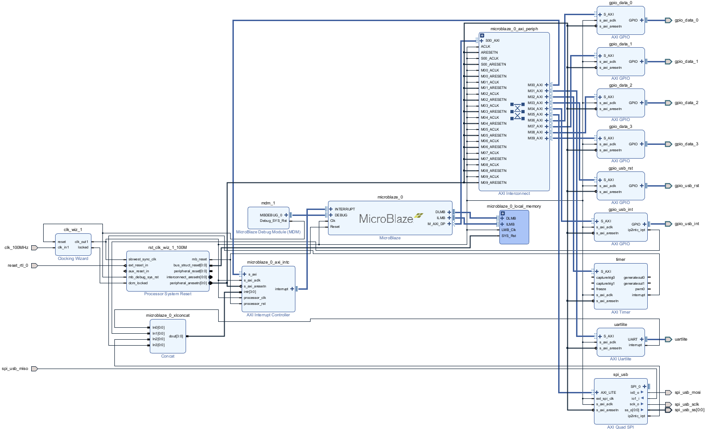</p>
        <figcaption><p>Vivado Block Design</p></figcaption>
    </figure>
</div>

### Summary of Block Design Components

#### Clocking Wizard

The clocking wizard generates arbitrary clock frequencies using a PLL.
The block design clocking wizard is redundant in this design, since the
block design just needs a single 100MHz clock, which is already provided
by the RealDigital Urbana board. However, we kept it in the design for
potential future use.

#### MicroBlaze Processor

The MicroBlaze is a 32-bit RISC processor designed by AMD for Xilinx
FPGAs. It's a soft-core processor, meaning it can be fully implemented
using the programmable logic resources of the FPGA. It uses the AXI
Interface as an I/O bus, allowing it to communicate with various
peripherals and memory components within the FPGA design. It also
supports local memory (LMB), JTAG-based debugging through the MicroBlaze
Debug Module (MDM), and interrupt handling through the AXI Interrupt
Controller.

#### MicroBlaze Debug Module (MDM)

The MicroBlaze Debug Module (MDM) is a dedicated hardware block that
provides debugging capabilities for the MicroBlaze. For example, it
allows for setting breakpoints in code, stepping through lines of code,
and other standard debugging features---all while the code runs on the
MicroBlaze processor within the FPGA. It interfaces with the MicroBlaze
via a dedicated debug interface, and connects to the JTAG port on the
FPGA board for communication with external debugging tools.
Specifically, the "PROG UART" port on the RealDigital Urbana board,
which is normally used for programming the FPGA, is also used for this
JTAG communication.

#### MicroBlaze Local Memory

The MicroBlaze Local Memory is a small, fast memory block that is
directly connected to the MicroBlaze processor. It implements the Local
Memory Bus (LMB) interface, which is a simple, low-latency bus designed
for high-speed access to memory. This local memory is typically used for
storing instructions, which are very frequently accessed. In our design,
we configured the local memory to be 128KB in size.

#### AXI Interconnect

The AXI Interconnect facilitates communication between the MicroBlaze
processor and various AXI peripherals in the design. It uses the AXI
protocol, with the MicroBlaze acting as the master and the peripherals
as slaves. It also handles properly routing transactions to the correct
peripheral based on the address being accessed. In our design, the AXI
Interconnect connects the MicroBlaze to nine peripherals: the AXI
Interrupt Controller, AXI Uartlite, AXI Timer, two GPIO modules for USB
communication, and four GPIO modules for plane state transfer to the
hardware design.

#### AXI Interrupt Controller

The AXI Interrupt Controller manages interrupt signals from various
peripherals and forwards them to the MicroBlaze processor. It's very
similar to the Platform-Level Interrupt Controller (PLIC) used in RISC-V
systems. It supports interrupt priorities, enabling/disabling
interrupts, and claiming/acknowledging interrupts from the MicroBlaze.
In our design, it connects to four interrupt sources: the AXI Uartlite,
AXI Timer, AXI Quad SPI, and AXI GPIO module used for USB interrupts.

#### Processor System Reset

The Processor System Reset module generates reset signals for the
MicroBlaze processor and other components in the design. It ensures that
all components are reset on power on, and also ensures that resets are
properly synchronized with the system clock. In our design, it generates
reset signals for the MicroBlaze, AXI Interconnect, AXI Interrupt
Controller, and all the AXI peripherals.

#### AXI Timer

The AXI timer allows the MicroBlaze to keep track of time by creating
programmable interrupt timers, which can be configured by the MicroBlaze
via AXI. This is useful because it allows the MicroBlaze to perform
time-based operations, such as polling the USB device at regular
intervals (as done in our design).

#### AXI Uartlite

The AXI Uartlite module allows the Microblaze to send and receive data
using the UART protocol. In our design, we use this module to allow the
MicroBlaze to print messages to a serial console, which get sent through
the "PROG UART" port on the RealDigital Urbana board. On the host
computer, we can use a serial terminal (like the `screen` command, or
the integrated debug console in Vitis) to view these messages.

#### AXI Quad SPI

The AXI Quad SPI module allows the MicroBlaze to communicate with SPI
devices using the SPI protocol. In our design, we use this module to
communicate with the MAX3421E USB controller chip.

#### AXI GPIO Modules

The AXI GPIO modules allow the MicroBlaze to interact with
general-purpose input/output (GPIO) pins on the FPGA board using
memory-mapped I/O. In our design, we use two AXI GPIO modules for USB
communication: one for reading USB interrupts from the MAX3421E chip,
and one for controlling the reset line of the MAX3421E chip.
Additionally, we use four AXI GPIO modules for transferring the plane
state from the MicroBlaze to the hardware design for rendering.

### Summary of Program Files

#### main.c

This file contains the main loop of the MicroBlaze software, which
continuously reads user inputs, updates flight dynamics, packs the plane
state, and writes it to GPIO for the hardware design to render.

#### usb.h

This header file defines the `usb_report` struct, which represents user
inputs from the USB keyboard.

#### usb.c

This file implements USB communication using the MAX3421E chip. It
contains the `usb_get_inputs` function, which reads keyboard inputs and
populates a `usb_report` struct. It also deals with USB setup and
configuration.

#### flight_sim.h

This header file defines three main structs: `plane_characteristics`,
which defines the physical characteristics of the aircraft;
`plane_state`, which defines the current state of the aircraft; and
`plane_state_export`, which defines the subset of the plane state that
is exported to the hardware design.

#### flight_sim.c

This file first instantiates a `plane_characteristics` variable with
reasonable values for a commercial aircraft. It then implements the
`init_plane_state` and `update_plane_state` functions, which update the
plane state based on user inputs and flight dynamics equations. It also
implements the `export_plane_state` function, which packs the plane
state into a `plane_state_export` struct for GPIO transfer.

Some helper functions used in this file include `d_sin` and `d_cos`,
which compute the sine and cosine of an angle in degrees, and
`get_nth_digit` and `get_nth_digit_d`, which extract specific decimal
digits from floats and doubles.

#### gpio.h

This header file defines structs representing the registers of each GPIO
peripheral used in the design. It also defines volatile pointers to the
base addresses of each GPIO peripheral for memory-mapped I/O.

#### gpio.c

This file implements the `write_plane_export_to_gpio` function, which
writes the packed plane state from a `plane_state_export` struct to the
appropriate GPIO peripherals using memory-mapped I/O.

#### Other Miscellaneous Files

`platform.h`, `platform.c`, and `platform_config.h` are standard files
generated by Vitis for setting up the MicroBlaze platform. They handle
low-level initialization of the processor and peripherals.

All files within the `lw_usb` directory implement a lightweight USB
stack for the MicroBlaze, including low-level USB operations and the
MAX3421E driver. These files are used in `usb.c` to handle USB
communication.

## FPGA Implementation

### RTL Block Diagram

The image below shows the RTL block diagram of the FPGA implementation.

<div align="center">
    <figure>
        <p>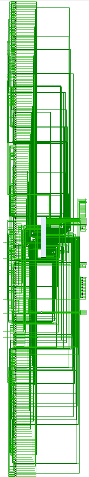</p>
        <figcaption><p>RTL Block Diagram, with the DDR3 renderer module shown in the center</p></figcaption>
    </figure>
</div>

### Design Analysis

Below are design analysis results for the FPGA implementation.

<table align="center">
    <tr>
        <th colspan="2">Utilization</th>
    </tr>
    <tr>
        <td>Look-Up Tables (LUTs)</td>
        <td>7096 / 32600 (21.77%)</td>
    </tr>
    <tr>
        <td>Digital Signal Processing Units (DSPs)</td>
        <td>71 / 120 (59.17%)</td>
    </tr>
    <tr>
        <td>Memory (BRAM)</td>
        <td>37.5 / 75 (50.0%)</td>
    </tr>
    <tr>
        <td>Memory (LUTRAM)</td>
        <td>500 / 9600 (5.21%)</td>
    </tr>
    <tr>
        <td>Latches</td>
        <td>0</td>
    </tr>
    <tr>
        <td>Flip-Flops (FFs)</td>
        <td>7493 / 65200 (11.49%)</td>
    </tr>
    <tr>
        <td>Input/Output (IO)</td>
        <td>88 / 210 (41.9%)</td>
    </tr>
    <tr>
        <td>Mixed-Mode Clock Managers (MMCMs)</td>
        <td>3 / 5 (60.0%)</td>
    </tr>
    <tr>
        <th colspan="2">Timing</th>
    </tr>
    <tr>
        <td>Worst Negative Slack (WNS)</td>
        <td>-3.234 ns</td>
    </tr>
    <tr>
        <td>Max Frequency</td>
        <td>75.563 MHz</td>
    </tr>
    <tr>
        <th colspan="2">Power</th>
    </tr>
    <tr>
        <td>Static Power</td>
        <td>7.7e-2 W</td>
    </tr>
    <tr>
        <td>Dynamic Power</td>
        <td>0.953 W</td>
    </tr>
    <tr>
        <td>Total Power</td>
        <td>1.03 W</td>
    </tr>
</table>

## Conclusion

Our expectation coming into this project was to get a fully functional
flight simulator with 3D graphics, full controls, and potential dynamic
terrain generation. However, we were not able to accomplish a lot of
these (ambitious) goals. This is partially due to certain design
decisions made which added unnecessary complexity to the system, and
made integration of the software and hardware components difficult. In
retrospect, our decision to use DDR3, while theoretically efficient,
forced us to implement a lot of supplementary logic such as caches and
DRAM arbiters in order to make the overall system performant. The
instrinsic complexity of our system alongside limited time due to other
challenging classes made finishing this project in its entirety rather
unrealistic.

There are several design decisions which, in retrospect, could have
simplified the system significantly.

- **Quantizing Z-values** - Because our 3D model doesn't move in the
  Z-direction significantly in the flight simulator, we can quantize
  these values to a small range (potentially 4-bit). With a
  significantly reduced Z-value size, we can store the entirety of the
  Z-buffer within a large BRAM instance. With the Z-buffer stored
  entirely in BRAM, we forgo the direct mapped cache and its associated
  logic within ddr3_renderer_top.

- **AXI** - We decided to transmit data through GPIO, rather than an
  established communication interface like AXI/AXI-Lite. In hindsight,
  integration of our hardware and software component could have been
  significantly easier with AXI handshaking (rather than relying on
  GPIO, which we found to be rather unreliable)

- **Color Space Reduction** - By reducing the color space from 16-bit
  RGB565 to 8-bit, we can have a higher pixel throughput (as our memory
  subsystem can now store twice the pixels as before).

Thus, there is a lot of work that can be done to extend the
functionality of this project, like adding some of the features which we
weren't able to implement. Luckily, there is a lot of physical space on
our FPGA for these features--we ended up using $21.77\%$ of the LUTs,
and $11.49\%$ of the FFs. This can be attributed to many optimizations
and our decision to use light-weight memory controllers rather than
LUT-intensive Xilinx IPs. However, we did use a significant amount of
DSP units ($59.17\%$), which limits the amount of arithmetic-intensive
units we can potentially add to the design.

Overall, we found this project to be very rewarding (albeit stressful).
We had extremely complex hardware and software components, and we put a
lot of work into writing (numerous) FSMs, memory controllers, and
graphics architectures. There was also a significant debugging component
to our project--especially considering the number of moving parts. We
would have to unit test each module, and then write larger testbenches
to test overall system functionality.

Lastly, rather than following a prexisting design, this project had us
making a lot of independent design decisions. We firmly believe our
experiences making these design decisions (some good, some awful in
retrospect) will be incredibly beneficial in our future endeavours in
digital hardware design.

### AI Usage

We used LLM tools to generate testbenches and templates for testbenches,
which were used to debug various HDL components of our project.

Our LLM of choice was Google's Gemini Pro.

### References

<https://alchitry.com/tutorials/projects/gpu/>

<https://github.com/someone755/ddr3-controller>

<https://github.com/kooltzh/xilinx-coe-generator/tree/master>

<https://www.cs.utexas.edu/~fussell/courses/cs384g-fall2013/lectures/lecture20-Z_buffer_pipeline.pdf>

<https://github.com/sylefeb/tinygpus>
